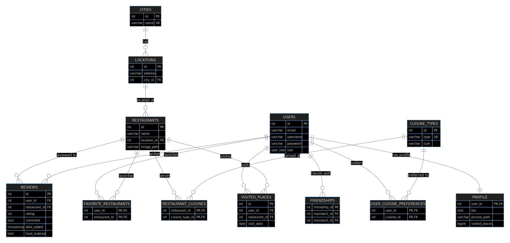

<a name="readme-top">GiroDelGusto</a>

[![LinkedIn][linkedin-shield]](www.linkedin.com/in/maciej-biegan)

<!-- PROJECT LOGO -->
<br />
<div align="center">
  <a href="https://github.com/MPT-B/GiroDelGusto">
    
  </a>

<h3 align="center">GiroDelGusto</h3>

  <p align="center">
    "GiroDelGusto" is an innovative mobile application designed for culinary enthusiasts seeking the perfect dining experience. Whether users are in search of their favorite dishes or eager to explore new gastronomic delights, our application provides a unique way to navigate, discover, and receive recommendations for restaurants. With "GiroDelGusto," users can satisfy their culinary cravings by effortlessly exploring a curated selection of dining establishments that cater to their tastes and preferences.
    <br />
    <a href="https://github.com/MPT-B/GiroDelGusto"><strong>Explore the docs »</strong></a>
    <br />
    <br />
    <a href="https://github.com/MPT-B/GiroDelGusto">View Demo</a>
    ·
    <a href="https://github.com/MPT-B/GiroDelGusto/issues">Report Bug</a>
    ·
    <a href="https://github.com/MPT-B/GiroDelGusto/issues">Request Feature</a>
  </p>
</div>

<!-- TABLE OF CONTENTS -->
<details>
  <summary>Table of Contents</summary>
  <ol>
    <li>
      <a href="#about-the-project">About The Project</a>
      <ul>
        <li><a href="#built-with">Built With</a></li>
        <li><a href="#database-description">Database description</a></li>
      </ul>
    </li>
    <li>
      <a href="#getting-started">Getting Started</a>
      <ul>
        <li><a href="#prerequisites">Prerequisites</a></li>
        <li><a href="#installation">Installation</a></li>
      </ul>
    </li>
    <li><a href="#usage">Usage</a></li>
    <li><a href="#roadmap">Roadmap</a></li>
    <li><a href="#contributing">Contributing</a></li>
    <li><a href="#license">License</a></li>
    <li><a href="#contact">Contact</a></li>
    <li><a href="#acknowledgments">Acknowledgments</a></li>
  </ol>
</details>

<!-- ABOUT THE PROJECT -->

## About The Project

<br>


<p align="right">(<a href="#readme-top">back to top</a>)</p>

## Database description

### One-to-Many Relationship between Cities and Locations:

- **cities** table has a primary key `id`.
- **locations** table has a foreign key `city_id` referencing the `id` in the **cities** table.
- This implies that one city can have multiple locations.

### One-to-Many Relationship between Cuisine Types and Restaurant Cuisines:

- **cuisine_types** table has a primary key `id`.
- **restaurant_cuisines** table has a foreign key `cuisine_type_id` referencing the `id` in the **cuisine_types** table.
- This implies that one cuisine type can be associated with multiple restaurant cuisines.

### Many-to-Many Relationship between Users and Friendships:

- **users** table has a primary key `id`.
- **friendships** table has two foreign keys, `member1_id` and `member2_id`, both referencing the `id` in the **users** table.
- This implies that users can have multiple friendships, forming a many-to-many relationship.

### One-to-One Relationship between Users and Profiles:

- **users** table has a primary key `id`.
- **profile** table has a foreign key `user_id` referencing the `id` in the **users** table.
- This implies that each user has a unique profile, forming a one-to-one relationship.

### One-to-Many Relationship between Users and Favorite Restaurants:

- **users** table has a primary key `id`.
- **favorite_restaurants** table has a foreign key `user_id` referencing the `id` in the **users** table.
- This implies that one user can have multiple favorite restaurants.

### One-to-Many Relationship between Restaurants and Reviews:

- **restaurants** table has a primary key `id`.
- **reviews** table has a foreign key `restaurant_id` referencing the `id` in the **restaurants** table.
- This implies that one restaurant can have multiple reviews.

### Many-to-Many Relationship between Users and Cuisine Preferences:

- **users** table has a primary key `id`.
- **user_cuisine_preferences** table has a foreign key `user_id` referencing the `id` in the **users** table.
- **user_cuisine_preferences** table also has a foreign key `cuisine_id` referencing the `id` in the **cuisine_types** table.
- This implies that users can have multiple cuisine preferences, forming a many-to-many relationship with cuisine types.

### One-to-Many Relationship between Users and Visited Places:

- **users** table has a primary key `id`.
- **visited_places** table has a foreign key `user_id` referencing the `id` in the **users** table.
- This implies that users can have multiple visited places.

### One-to-Many Relationship between Restaurants and Restaurant Cuisines:

- **restaurants** table has a primary key `id`.
- **restaurant_cuisines** table has a foreign key `restaurant_id` referencing the `id` in the **restaurants** table.
- This implies that one restaurant can have multiple associated cuisine types.

### ERD DIAGRAM



<p align="right">(<a href="#readme-top">back to top</a>)</p>

### Built With

- [](https://developer.mozilla.org/en-US/docs/Web/Guide/HTML/HTML5)
- [](https://developer.mozilla.org/en-US/docs/Web/CSS)
- [](https://www.php.net/)
- [](https://developer.mozilla.org/en-US/docs/Web/JavaScript)
- [](https://www.docker.com/)
- [](https://nginx.org/)

<p align="right">(<a href="#readme-top">back to top</a>)</p>

<!-- GETTING STARTED -->

## Getting Started

This is an example of how you may give instructions on setting up your project locally.
To get a local copy up and running follow these simple example steps.

### Prerequisites

### Installation

1. Clone the repo
   ```sh
   git clone https://github.com/MPT-B/GiroDelGusto.git
   ```
2. Build the Docker image
   ```sh
   docker build -t girodelgusto-app .
   ```
3. Run Docker Compose
   ```sh
   docker-compose up -d
   ```
4. Import Database from sql file

<p align="right">(<a href="#readme-top">back to top</a>)</p>

<!-- USAGE EXAMPLES -->

## Usage

Use this space to show useful examples of how a project can be used. Additional screenshots, code examples and demos work well in this space. You may also link to more resources.

_For more examples, please refer to the [Documentation](https://example.com)_

<p align="right">(<a href="#readme-top">back to top</a>)</p>

<!-- ROADMAP -->

## Roadmap

- [ ] **Find best restaurant in Town**

  - Find best restaurant in the town

- [ ] **Favorite List**

  - Add restaurant to the favorite list

- [ ] **Sharing thoughts in community**

  - Share your favorite restaurant and review about visited restaurant

    - [ ] **Nested Feature**
      - Create a community where you can talk about best restaurant

See the [open issues](https://github.com/MPT-B/GiroDelGusto/issues) for a full list of proposed features (and known issues).

Feel free to tailor the descriptions based on the actual features and their specifics in your project. Providing clear and detailed information can help contributors and users better understand the roadmap and goals of your project.

<p align="right">(<a href="#readme-top">back to top</a>)</p>

<!-- CONTRIBUTING -->

## Contributing

Contributions are what make the open source community such an amazing place to learn, inspire, and create. Any contributions you make are **greatly appreciated**.

If you have a suggestion that would make this better, please fork the repo and create a pull request. You can also simply open an issue with the tag "enhancement".
Don't forget to give the project a star! Thanks again!

1. Fork the Project
2. Create your Feature Branch (`git checkout -b feature/AmazingFeature`)
3. Commit your Changes (`git commit -m 'Add some AmazingFeature'`)
4. Push to the Branch (`git push origin feature/AmazingFeature`)
5. Open a Pull Request

<p align="right">(<a href="#readme-top">back to top</a>)</p>

<!-- LICENSE -->

## License

Distributed under the GNU Affero General Public License (AGPL) version 3.0.

<p align="right">(<a href="#readme-top">back to top</a>)</p>

<!-- CONTACT -->

## Contact

Maciej Biegan - [@Biegan_M](https://twitter.com/@Biegan_M) - biegan664maciek@gmail.com

Project Link: [https://github.com/MPT-B/GiroDelGusto](https://github.com/MPT-B/GiroDelGusto)

<p align="right">(<a href="#readme-top">back to top</a>)</p>

<!-- ACKNOWLEDGMENTS -->

<!-- ## Acknowledgments

- []()
- []()
- []() -->

<!-- <p align="right">(<a href="#readme-top">back to top</a>)</p> -->

<!-- MARKDOWN LINKS & IMAGES -->
<!-- https://www.markdownguide.org/basic-syntax/#reference-style-links -->

[contributors-shield]: https://img.shields.io/github/contributors/MPT-B/GiroDelGusto.svg?style=for-the-badge
[contributors-url]: https://github.com/MPT-B/GiroDelGusto/graphs/contributors
[forks-shield]: https://img.shields.io/github/forks/MPT-B/GiroDelGusto.svg?style=for-the-badge
[forks-url]: https://github.com/MPT-B/GiroDelGusto/network/members
[stars-shield]: https://img.shields.io/github/stars/MPT-B/GiroDelGusto.svg?style=for-the-badge
[stars-url]: https://github.com/MPT-B/GiroDelGusto/stargazers
[issues-shield]: https://img.shields.io/github/issues/MPT-B/GiroDelGusto.svg?style=for-the-badge
[issues-url]: https://github.com/MPT-B/GiroDelGusto/issues
[license-shield]: https://img.shields.io/github/license/MPT-B/GiroDelGusto.svg?style=for-the-badge
[license-url]: https://github.com/MPT-B/GiroDelGusto/blob/master/LICENSE.txt
[linkedin-shield]: https://img.shields.io/badge/-LinkedIn-black.svg?style=for-the-badge&logo=linkedin&colorB=555
[linkedin-url]: https://linkedin.com/in/maciej-biegan
[product-screenshot]: images/screenshot.png
[Next.js]: https://img.shields.io/badge/next.js-000000?style=for-the-badge&logo=nextdotjs&logoColor=white
[Next-url]: https://nextjs.org/
[React.js]: https://img.shields.io/badge/React-20232A?style=for-the-badge&logo=react&logoColor=61DAFB
[React-url]: https://reactjs.org/
[Vue.js]: https://img.shields.io/badge/Vue.js-35495E?style=for-the-badge&logo=vuedotjs&logoColor=4FC08D
[Vue-url]: https://vuejs.org/
[Angular.io]: https://img.shields.io/badge/Angular-DD0031?style=for-the-badge&logo=angular&logoColor=white
[Angular-url]: https://angular.io/
[Svelte.dev]: https://img.shields.io/badge/Svelte-4A4A55?style=for-the-badge&logo=svelte&logoColor=FF3E00
[Svelte-url]: https://svelte.dev/
[Laravel.com]: https://img.shields.io/badge/Laravel-FF2D20?style=for-the-badge&logo=laravel&logoColor=white
[Laravel-url]: https://laravel.com
[Bootstrap.com]: https://img.shields.io/badge/Bootstrap-563D7C?style=for-the-badge&logo=bootstrap&logoColor=white
[Bootstrap-url]: https://getbootstrap.com
[JQuery.com]: https://img.shields.io/badge/jQuery-0769AD?style=for-the-badge&logo=jquery&logoColor=white
[JQuery-url]: https://jquery.com
